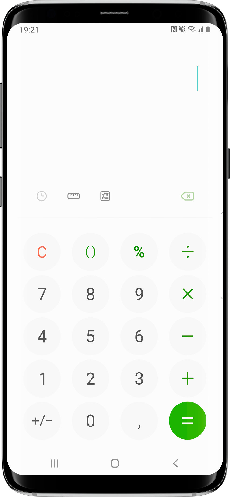

# Android system bars transparent

One of the difficulties that we have in firemonkey is to have more control of the system bars and this is so important for the design of the app that it should be done in a simple way via form properties, but as this is not yet possible I will teach here how to leave the system bars (status bar and navigation bar) background full transparent, including on the splash screen, to improve the design of the forms.

With this you will be able to draw freely behind the system bars, allowing a more beautiful app:

<p align="center">
  
</p>

## TAndroidSystemBars

In this repository you need to download the iPub.Android.SystemBars.pas, to access the structure TAndroidSystemBars:
  ```delphi
  TAndroidSystemBars = record
  public
    class procedure RemoveSystemBarsBackground(ANearStatusBarColor, ANearNavigationBarColor: TAlphaColor); static;
	class function SystemInsets: TRectF; static;
	class function TappableInsets: TRectF; static;
	class property OnInsetsChange: TNotifyEvent read FOnInsetsChange write FOnInsetsChange;
  end;
  ```

### TAndroidSystemBars.RemoveSystemBarsBackground

We will try to remove the system bars (status bar and navigation bar) background (ignoring ANearStatusBarColor, ANearNavigationBarColor parameters) and set the app layout to cover the entire screen, that is, the form will expand to below the status bar and navigation bar. However in older android versions we don't have support to transparent status bar or transparent navigation bar, but some versions have the option to set an opaque color to system bars. When possible we will adjust automatically the light of system bars content (system bars foreground color) checking the brightness of AStatusBarColor and ANavigationBarColor to set the dark or light foreground.

Notes: 
  1) don't use this before the OnCreate of main form
  2) you need to call SystemInsets or TappableInsets to get the sizes of system bars to set the padding in your form to avoid some controls like TEdit or TButton to go below the system bar;

Example:

  ```delphi
  uses
    iPub.Android.SystemBars;
  
  procedure TForm1.FormCreate(Sender: TObject);
  begin
    Fill.Kind := TBrushKind.Solid;
    Fill.Color := TAlphaColors.White;
    TAndroidSystemBars.RemoveSystemBarsBackground(TAlphaColors.White, TAlphaColors.White);
  end;
  ```

### TAndroidSystemBars.SystemInsets and TAndroidSystemBars.TappableInsets

After call the "RemoveSystemBarsBackground" your form will expand to below the system bars, then you will need to call the SystemInsets or TappableInsets to get the system sizes to set the form padding to ajust the controls align of your form to don't go below the system bars (for example, one TButton with align top). Example:

  ```delphi
  uses
    iPub.Android.SystemBars;
  
  procedure TForm1.FormCreate(Sender: TObject);
  begin
    Fill.Kind := TBrushKind.Solid;
    Fill.Color := TAlphaColors.White;
    TAndroidSystemBars.RemoveSystemBarsBackground(TAlphaColors.White, TAlphaColors.White);
	Padding.Rect := TAndroidSystemBars.TappableInsets;
  end;
  ```

You may be confused by these two function names, but they are the official names that android uses. To clarify, the system insets are basically the sizes of the system bars (status bar, navigation bar, gesture bar, IME and others). In the past it was necessary to deal with the size of the status bar and after the navigation bar, but other types of bars have appeared and to make the programmer's life complex, the size of all bars in the system has been summarized in insets. You do not need to know if there is a status bar, and what the size of the status bar is, and on which side of the screen it is located, just like the other types of bar, you just need to treat the Insets which is the summary of the sizes as said .

**Difference between SystemInsets and TappedInsets**

Today there are types of bars that cannot be directly above content as it would make reading difficult, such as StatusBar and NavigationBar directly above text, however there are bars that were made to be directly above content, such as GestureBar ( bar that replaces the navigation bar on newer phones). So there are two types of insets:

SystemInsets: Sizes of all system sidebars (main ones: StatusBar, NavigationBar and GestureBar)
TappedInsets: Size of system sidebars that cannot be directly above content (main: StatusBar and NavigationBar)

### TAndroidSystemBars.OnInsetsChange

This event will be triggered always when any insets (system bars sizes) change. It is important to implement this event because a common example of triggering is when rotating the screen of your app, as your navigation bar will probably go to the right of the screen or to the left of the screen, so you will have to adjust the Padding of the form to avoid that the content is below the status bar.
  
## Splash screen - System bars and background

The class TAndroidSystemBars is just to use in runtime, after the application full launch. But if you don't change the default "styles.xml" and "splash_image_def.xml" provided by Delphi, you will have an ugly system bars or simply not predictable (some devices may be white, others black or even gray), and the splash screen background will be always black. To fix the system bars colors and background color of splash screen you should change the "styles.xml" and "splash_image_def.xml" files.

### Creating "styles.xml"

Create one file called "styles.xml" with the following content:

  ```xml
  <resources xmlns:android="http://schemas.android.com/apk/res/android">
      <style name="AppTheme" parent="@android:style/Theme.Material.Light.NoActionBar">
          <item name="android:navigationBarColor">#01ffffff</item>
          <item name="android:statusBarColor">#00000000</item>
          <item name="android:colorPrimary">#ffffff</item>
          <item name="android:windowBackground">@drawable/splash_image_def</item>
      </style>
  </resources>
  ```

In this content above I used the white color example (#ffffff) but you can change it to your color but note that in navigationBarColor the color need to start with "#01" to set the alpha value to 1 to solve problems found in LG devices

Save the file in one subdirectory of your project, like "resources" subdirectory, for example.

### Creating "splash_image_def.xml"

Create one file called "splash_image_def.xml" with the following content:

  ```xml
  <?xml version="1.0" encoding="utf-8"?>
  <layer-list xmlns:android="http://schemas.android.com/apk/res/android">
    <item>
      <shape android:shape="rectangle">
        <solid android:color="#ffffff" />
      </shape>
    </item>
    <item>
      <bitmap android:gravity="center" android:src="@drawable/splash_image" />
    </item>
  </layer-list>
  ```

In this content above I used one white color example (#ffffff) but you can change it to your color.

Save the file in one subdirectory of your project, like "resources" subdirectory, for example.

### Deploying the "styles.xml" and "splash_image_def.xml"

 1) Open your Project > Deployment, then you need to apply the following steps below for Android 32/64 bits in Release and Debug mode:
 2) Look in the "Local Name" column and disable these 3 default files: "styles.xml", "styles-v21.xml" and "splash_image_def.xml"
 3) Add your own "styles.xml" file and set the Remote Path field to "res\values"
 4) Add your own "splash_image_def.xml" file and set the Remote Path field to "res\drawable"

Now you can uninstall your app, compile and run to see the difference ;)

## Compatibility

I made some tests with Delphi Sydney 10.4.1 and Delphi Rio 10.3.3 running the app in some devices:

    LG       - LM-X430 Android32 10.0.0 (API level 29)
    SAMSUNG  - SM-A013M Android32 10.0.0 (API level 29)
    SAMSUNG  - SM-G955F Android64 9.0.0 (API level 28)
    SAMSUNG  - SM-G935F Android64 8.0.0 (API level 26)
    MOTOROLA - MotoG3 Android32 6.0.0 (API level 23)

All worked perfectly. But these codes should work well on all android versions supported by delphi (Android 6 to Android 11), although it is likely to work on older Android devices as well.