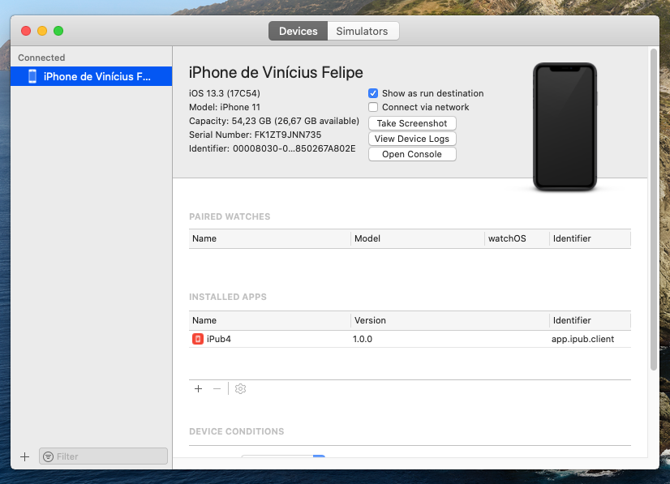
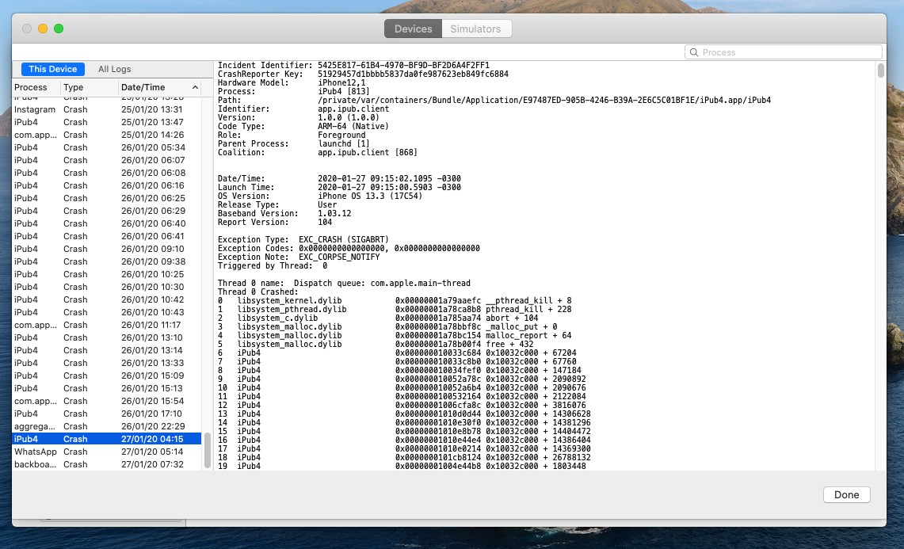
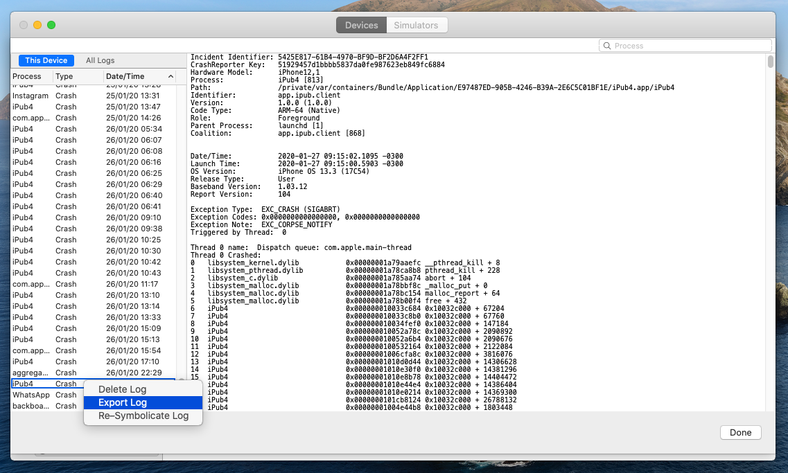
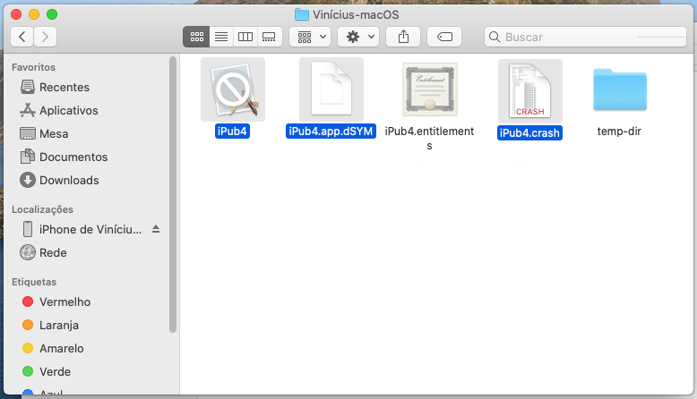
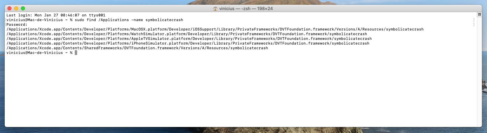
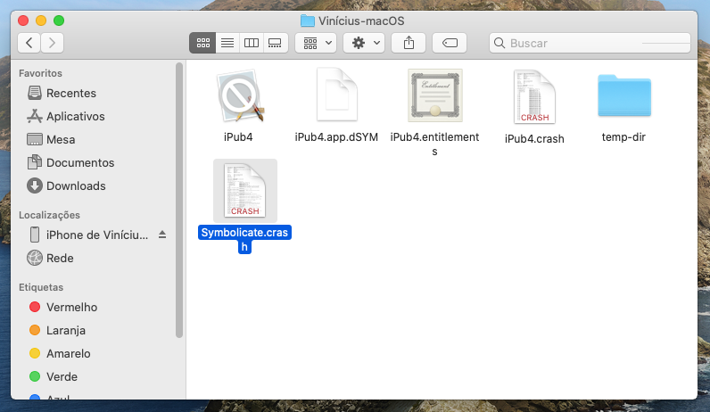
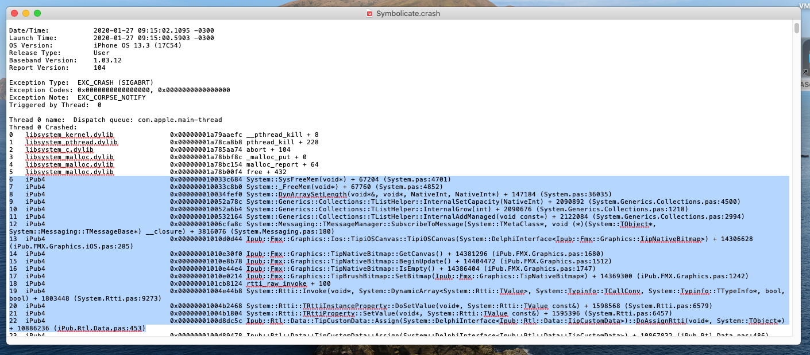

# Delphi iOS - Exploring app crashes
First of all, as most of you already know, there is a code from Erik Van Bilsen (blog Grijjy), which is spectacular to make an error report on firemonkey iOS apps to return the call stack of exceptions, so you can send it via email , or show using Log.d, for example, that I recommend to everyone: https://github.com/grijjy/JustAddCode/tree/master/ErrorReporting

However, as Erik himself warns, 
> “the app may still crash… before we get a chance to handle the exception”

This means that in some cases you will not be able to catch the error either with a try except, or with the error report of Erik, because the app will simply crash (close unexpectedly), and here I will explain how we can better investigate these crashes.

## Step 1 - iOS crash report file
Every time your app crashes, the ios automatically generate a crash report file, even if you are not debugging, or even if your device is not connected to your Mac, this file is always generated. To access this file you need to:
1)	Connect your device to your Mac
2)	Open the **Xcode**, go to **Window > Devices and Simulators >**
3)	In the Devices tab, select your device, and click in button "**View Device Logs**"

4)	You will see all crash reports of the iOS in your device, you can find your process and the last crash of it, and select it, as below:

See that this crash log does not display the call stack correctly, it only shows the addresses of the methods, but not their name, this is called unsymbolicated crash file, and that is what we will solve from now.
5)	**Right click** > **Export Log**, as bellow:

6)	Save the file to 
```/Users/<user>/PAServer/scratch-dir/<user>-macOS/<myApp>.crash```
    -	Example the path in my mac: 
    ```/Users/vinicius/PAServer/scratch-dir/Vinícius-macOS/iPub4.crash```
    -	To be sure which way is right, you can also open a **Terminal**, and open the **Finder** in **Home Folder**, access the "**PAServer**" folder, access the “**scratch-dir**” folder and drag and drop the “**<user>-macOS**” folder inside the **Terminal**, then will show the full path of the folder
    -	Keep in mind this path, we will use it in the next steps.
7)	Close the **Xcode**

## Step 2 - Check the app symbols file
Every time delphi compiles for iOS, in the folder where we saved the crash file, in the Mac, the PAServer save your app file and your app symbols file, that is, the files **<MyApp>.app** and **<MyApp>.app.dSYM**. So in this folder make sure that there will be these two files and the crash file, as bellow:


**Note:** Is very important to compile the app with the debug mode to generate a complete dSYM file, even if the app has crashed with closed delphi debugging, this dSYM file that will contain the symbols we need (unit and method names)

## Step 3 - Finding the symbolicatecrash app in your Mac
We need to have the path of the symbolicatecrash app in your Mac to do the last step. To find it:
1) Open the **Terminal** and type the command
```sudo find /Applications -name symbolicatecrash```
2) Type the password and wait the result, as bellow:

3) We will prefer the symbolicatecrash that contains “SharedFrameworks” in the path, because it is compatible with all Apple platforms
In my case, the path is:
```/Applications/Xcode.app/Contents/SharedFrameworks/DVTFoundation.framework/Versions/A/Resources/symbolicatecrash```

## Step 4 - Symbolizing the crash file
Now that we have: 
- the path inside the PAServer folder where our app files are located, and now also our crash file;
- the path of the app symbolicatecrash in your mac;

We will go to symbolize the crash file:
1)	Open a new Terminal
2)	Access the path inside the PAServer folder, where our file apps is inside, in my case, doing the command:
```cd /Users/vinicius/PAServer/scratch-dir/Vinícius-macOS```
3)	Set the DEVELOPER_DIR with the command:
```export DEVELOPER_DIR=/Applications/Xcode.app/Contents/Developer```
4)	Use the app symbolicatecrash (the path that we get in previous step) to symbolize the crash file, with the command:
```<symbolicatecrash app path> <MyApp>.crash <MyApp>.app > Symbolicate.crash```
    - In my case:
    ```/Applications/Xcode.app/Contents/SharedFrameworks/DVTFoundation.framework/Versions/A/Resources/symbolicatecrash iPub4.crash iPub4.app > Symbolicate.crash```
5) Now you will check the new file “**Symbolicate.crash**” together with the file “**<MyApp>.crash**”, as bellow:

6)	Now just open the "**Symbolicate.crash**" file with the **Text Editor**, and you will see the crash file with complete informations of call stacks:

